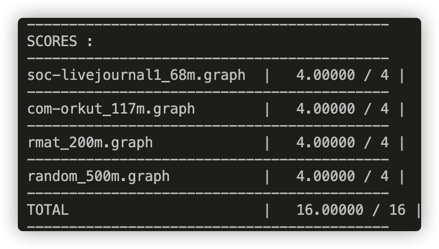
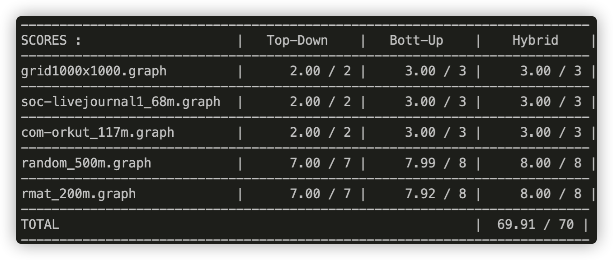

# Assignment 4: Big Graph Processing in OpenMP

The original handout is [here](./Handout.md).

To learn the basics of openmp, I highly recommend this [tutorial](./openmp_tutorial/Intro_To_OpenMP_Mattson.pdf).

To understand the **omp parallel for** better, you should read this [short article](./openmp_tutorial/OpenMP_Dynamic_Scheduling.pdf). 

There is also a openmp cheatsheet for you [here](./openmp_tutorial/OpenMP3.0-SummarySpec.pdf).

## Part 1: Warm up: Implementing Page Rank (16 points)



## Part 2 - 4: Parallel Breadth-First Search



---

Q1 : In Part 2 (Top Down) and 3 (Bottom Up), where is the synchronization in each of your solutions? Do you do anything to limit the overhead of synchronization?

Answer : In **Top Down** version, there are two synchronizations:

- First, when one thread wants to check the unvisited nodes, we should synchronize it to avoid two threads visiting the same node simultaneously.

```c++
if (distances[outgoing] == NOT_VISITED_MARKER && 
    __sync_bool_compare_and_swap(&distances[outgoing], NOT_VISITED_MARKER, distances[node] + 1)) {
    local_frontier[local_count++] = outgoing;
}
```

- Second, when add nodes into the frontier.

```c++
int start_idx = __sync_fetch_and_add(&new_frontier->count, local_count);
memcpy(new_frontier->vertices + start_idx, local_frontier, local_count * sizeof(int));
```

In **Bottom Up** version, there is only one synchronization which is the same as the second one of the **Top Down** version.

---

Q2 : In Part 4(Hybrid), did you decide to switch between the top-down and bottom-up BFS implementation dynamically? How did you decide which implementation to use?

Answer : Yes. My strategy is quite simple. When the nodes in the frontier are more than the threshold, I choose the **bottom up** version, and vice versa.

```c++
        if (frontier->count >= THRESHOLD) {
            bottom_up_step(graph, frontier, new_frontier, sol->distances, iteration);
        } else {
            top_down_step(graph, frontier, new_frontier, sol->distances);
        }
```

---

Q3 : Why do you think your code (and the staff reference) is unable to achieve perfect speedup ?

- Workload imbalance : No matter the bottom up or top down, the work load assigned to each thread depends on the topology of the graph and is highly dynamic.
- Synchronization : Both version needs synchronization to perform correctly.
- Data movement : Each thread needs to move its local frontier into the global frontier which creates overhead.

